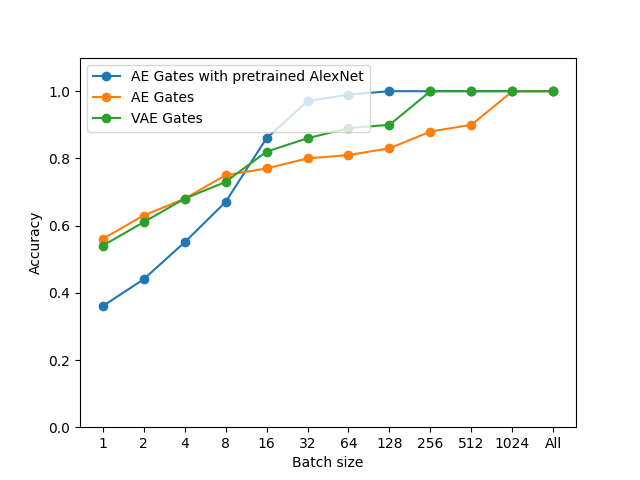
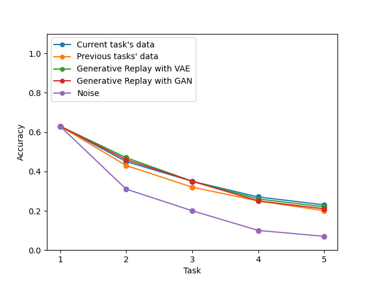
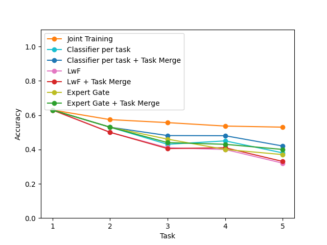
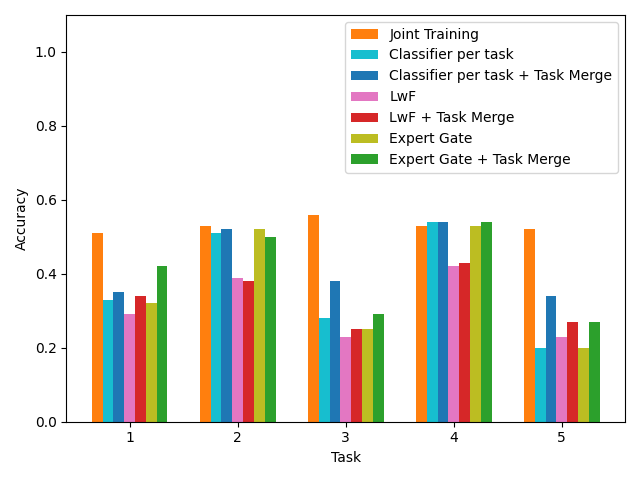

# C3: Continual CIFAR Classifier

## Setup
Download CIFAR-100 dataset
```
wget https://www.cs.toronto.edu/~kriz/cifar-100-python.tar.gz 
tar xf cifar-100-python.tar.gz -C CIFAR/ --strip-components 1
rm cifar-100-python.tar.gz 
```
## Models and training
### Baselines
#### AlexNet
One jointly trained classifier for 100 classes.
```
python train_AlexNet.py
```
#### AlexNets with task oracle
5 AlexNets (one per 20 classes) with task oracle used in testing phase.
```
python train_AlexNets_with_Oracle.py
```
### Models trained independently per task
### Autoencoders 
Used for task prediction as Autoencoder Gates. VAEs used additionally for Generative Replay.
```
python train_AEs.py
```
Parameter ae_type deteremines type:
* AE: autoencoder
* VAE: variational autoencoder (used additionally for Generative Replay)
* AE_ImageNet: autoencoder that uses as an input activations from last convolutional layerof AlexNet pretrained on ImageNet

### Generative adversalial networks
Used for Generative Replay.
```
python train_GANs.py
```
## Training in incremental setting
```
python train_main.py
```
Significant parameters:
* Autoencoder Gate type: AE or VAE
* relatedness_threshold: threshold for Expert Gate and Merge Task
* GR: type of replay
    * None: standard LwF, current task's data
    * real: access to all data, using previous tasks' data for knowledge distillation
    * noise: using noise instead of proper data for knowledge distillation
    * VAE of GAN: Generative Replay using VAE or GAN trained for each task

## Results
 
 

